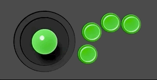

arcadebuttons-node-pi
=====================

Reads the input of buttons from GPIO pins on a Raspberry Pi and displays them on a webpage using Node.js.

# Backstory

I play arcade games (mostly shmups) and sometimes stream on [twitch.tv](http://twitch.tv/pdp80) from my arcade cabinet.  My JAMMA capture setup is [detailed here](http://shmups.system11.org/viewtopic.php?f=6&t=45917). I taped a webcam to my ceiling to capture the joystick movements, but its hard to tell what inputs are being made due to poor lighting and my hands being in the way. Other players who play from within MAME can have a nice input display that shows the movements they're making. This project is an attempt at providing that kind of input display for an actual arcade cabinet.

I have a Raspberry Pi under the control panel of my arcade cabinet with the control wires split off and plugged into the GPIO pins. This app provides a nice display that I can use while streaming. This is probably not the easiest or most lightweight way to do this but I wanted to play around with Node.js and the asynchronous nature of human inputs seemed like a good project to learn with.

After upgrading to a Raspberry Pi 2 and using a wired ethernet connection between the Pi and the PC I use for streaming, the lag in the inputs is virtually non-existant and the display is rock solid.
